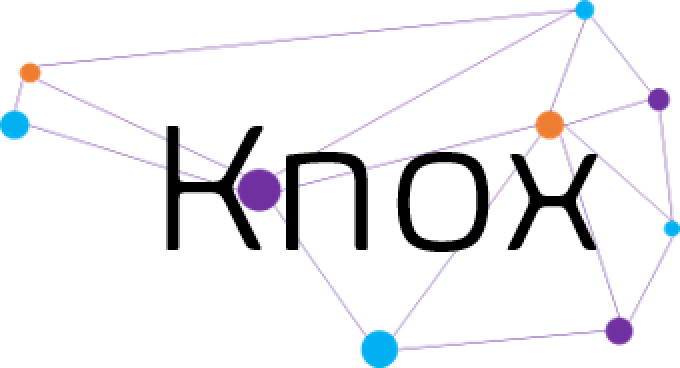

  

# KnoxAI - A Framework for Combinatorial Design Prediction
knoxAI is a modular deep learning framework for graph-based and rule-based machine learning, built with FastAPI. It supports regression, classification, and ranking tasks on graph-structured data, and provides a REST API for model training, evaluation, and prediction. Runs are saved and managed through MLflow.
## Quickstart

### Installation
1) Clone this repository
2) Install dependencies `pip install -r requirements.txt`
3) Run `uvicorn app.main:api --reload --host 0.0.0.0 --port 8000` in the root directory of this repo
4) For MLflow user-interface run `mlflow ui --port 5000 --workers 1` in the root directory of this repo

### Use with [Knox](https://github.com/CIDARLAB/knox) or Standalone

## Manuscripts

Nicholas Roehner, James Roberts, Andrei Lapets, Dany Gould, Vidya Akavoor, Lucy Qin, D. Benjamin Gordon, Christopher Voigt, and Douglas Densmore. GOLDBAR: A Framework for Combinatorial Biological Design. ACS Synthetic Biology Article ASAP (2024). 
DOI: https://pubs.acs.org/doi/full/10.1021/acssynbio.4c00296

## Webpage

https://www.cidarlab.org/knox
